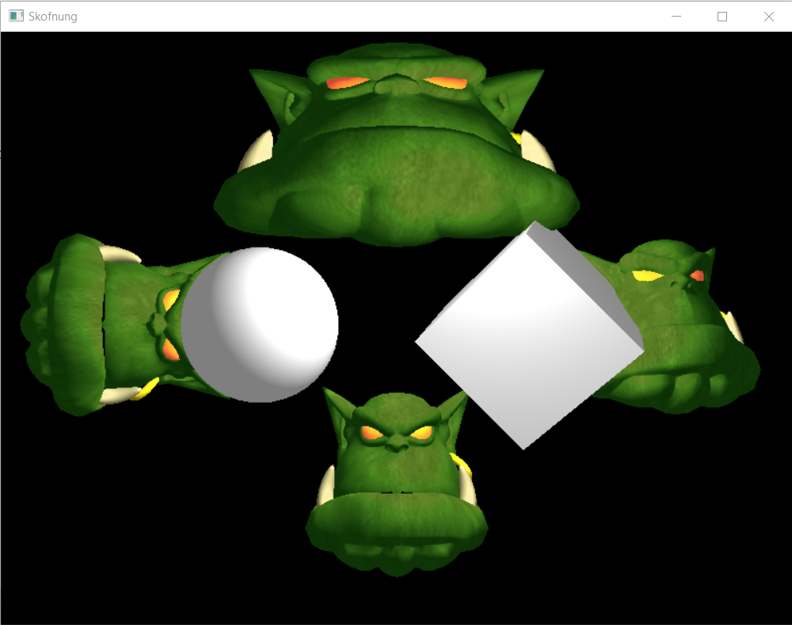

Skofnung
=====

Skofnung is an application that uses [Ogre](https://www.ogre3d.org/) as its rendering engine. It demonstrates how to load meshes, create MeshPtr objects, and set up a basic camera and lighting.

You can use `README - Skofnung project properties.txt` for ideas on how you might want to structure your own Ogre project and use VS build events.

Note: Skofnung has its VS solution and project files in different directories for flexibility (e.g., we want the Skofnung solution to encompass different projects that all rely upon the libraries in `extern`.) There is nothing specific to Ogre demanding this structure.

### Origin of the project's name

I wanted a unique name in case I ever developed this application beyond an Ogre tech demo. [Skofnung](https://en.wikipedia.org/wiki/Skofnung) was the sword of legendary Danish king Hrólf Kraki, renowned for supernatural sharpness and hardness -- as well as for being imbued with the spirits of the king's twelve faithful berserker bodyguards.
